ggplot1
================

``` r
library(tidyverse)
```

    ## ── Attaching packages ─────────────────────────────────────── tidyverse 1.3.1 ──

    ## ✓ ggplot2 3.3.5     ✓ purrr   0.3.4
    ## ✓ tibble  3.1.4     ✓ dplyr   1.0.7
    ## ✓ tidyr   1.1.3     ✓ stringr 1.4.0
    ## ✓ readr   2.0.1     ✓ forcats 0.5.1

    ## ── Conflicts ────────────────────────────────────────── tidyverse_conflicts() ──
    ## x dplyr::filter() masks stats::filter()
    ## x dplyr::lag()    masks stats::lag()

``` r
library(patchwork)
knitr::opts_chunk$set(
  fig.width = 6,
  fig.asp = 0.6,
  out.width = "90%"
)
```

\#load a dataset that we’ll use often

``` r
weather_df = 
  rnoaa::meteo_pull_monitors(
    c("USW00094728", "USC00519397", "USS0023B17S"),
    var = c("PRCP", "TMIN", "TMAX"), 
    date_min = "2017-01-01",
    date_max = "2017-12-31") %>%
  mutate(
    name = recode(
      id, 
      USW00094728 = "CentralPark_NY", 
      USC00519397 = "Waikiki_HA",
      USS0023B17S = "Waterhole_WA"),
    tmin = tmin / 10,
    tmax = tmax / 10) %>%
  select(name, id, everything())
```

    ## Registered S3 method overwritten by 'hoardr':
    ##   method           from
    ##   print.cache_info httr

    ## using cached file: ~/Library/Caches/R/noaa_ghcnd/USW00094728.dly

    ## date created (size, mb): 2021-10-05 20:10:57 (7.602)

    ## file min/max dates: 1869-01-01 / 2021-10-31

    ## using cached file: ~/Library/Caches/R/noaa_ghcnd/USC00519397.dly

    ## date created (size, mb): 2021-10-05 20:11:05 (1.697)

    ## file min/max dates: 1965-01-01 / 2020-02-29

    ## using cached file: ~/Library/Caches/R/noaa_ghcnd/USS0023B17S.dly

    ## date created (size, mb): 2021-10-05 20:11:08 (0.912)

    ## file min/max dates: 1999-09-01 / 2021-09-30

# Scatterplot

tmax vs. tmin

``` r
weather_df %>% 
  ggplot(aes(x=tmin, y=tmax, color = name)) +
  geom_point(alpha = 0.3) + 
  geom_smooth(se = FALSE) +
  facet_grid(.~ name)
```

    ## `geom_smooth()` using method = 'loess' and formula 'y ~ x'

    ## Warning: Removed 15 rows containing non-finite values (stat_smooth).

    ## Warning: Removed 15 rows containing missing values (geom_point).

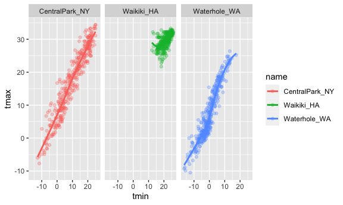

``` r
weather_df %>% 
  ggplot(aes(x=date, y=tmax, size = prcp)) +
  geom_point(alpha = 0.3) +
  geom_smooth(se=FALSE) +
  facet_grid(.~ name)
```

    ## `geom_smooth()` using method = 'loess' and formula 'y ~ x'

    ## Warning: Removed 3 rows containing non-finite values (stat_smooth).

    ## Warning: Removed 3 rows containing missing values (geom_point).

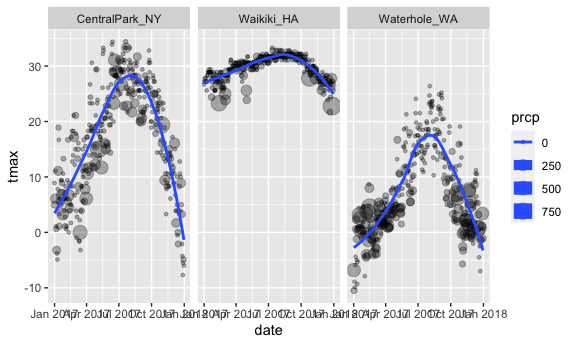
\#Remember this plot

``` r
weather_df %>% 
  ggplot(aes(x=tmin, y=tmax, color = name))+
  geom_point(alpha = 0.3)
```

    ## Warning: Removed 15 rows containing missing values (geom_point).

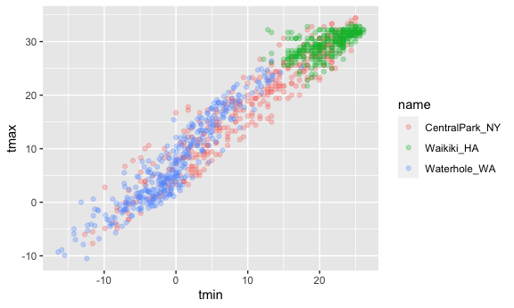
\#Labels

``` r
weather_df %>% 
  ggplot(aes(x=tmin, y=tmax, color = name))+
  geom_point(alpha = 0.3) +
  labs(
    title = "Temperature Plot",
    x = "Minimum Daily Temperature (C)",
    y = "Maximum Daily Temperature (C)",
    caption = "data from RNOA package"
  )
```

    ## Warning: Removed 15 rows containing missing values (geom_point).

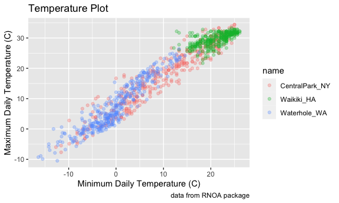

\#Scales

``` r
weather_df %>% 
  ggplot(aes(x=tmin, y=tmax, color = name))+
  geom_point(alpha = 0.3) +
  labs(
    title = "Temperature Plot",
    x = "Minimum Daily Temperature (C)",
    y = "Maximum Daily Temperature (C)",
    caption = "data from RNOA package"
  ) + 
  scale_x_continuous(
    breaks = c(-15, 0, 15),
    labels = c("-15 º C", "0", "15")
  ) +
  scale_y_continuous(
    trans = "sqrt"
  )
```

    ## Warning in self$trans$transform(x): NaNs produced

    ## Warning: Transformation introduced infinite values in continuous y-axis

    ## Warning: Removed 90 rows containing missing values (geom_point).

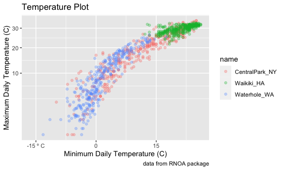

``` r
weather_df %>% 
  ggplot(aes(x=tmin, y=tmax, color = name))+
  geom_point(alpha = 0.3) +
  labs(
    title = "Temperature Plot",
    x = "Minimum Daily Temperature (C)",
    y = "Maximum Daily Temperature (C)",
    caption = "data from RNOA package"
  ) + 
  viridis::scale_color_viridis(
    name = "location",
    discrete = TRUE
  )
```

    ## Warning: Removed 15 rows containing missing values (geom_point).

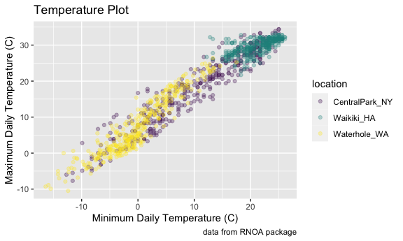

\#Themes

``` r
weather_df %>% 
  ggplot(aes(x=tmin, y=tmax, color = name))+
  geom_point(alpha = 0.3) +
  labs(
    title = "Temperature Plot",
    x = "Minimum Daily Temperature (C)",
    y = "Maximum Daily Temperature (C)",
    caption = "data from RNOA package"
  ) + 
  viridis::scale_color_viridis(
    name = "location",
    discrete = TRUE
  ) +
  theme(legend.position = "bottom")
```

    ## Warning: Removed 15 rows containing missing values (geom_point).

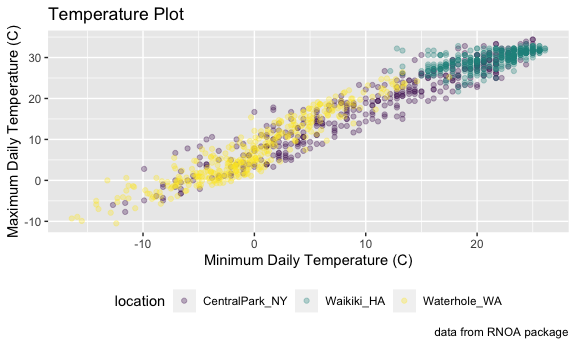

\#Themes

``` r
weather_df %>% 
  ggplot(aes(x=tmin, y=tmax, color = name))+
  geom_point(alpha = 0.3) +
  labs(
    title = "Temperature Plot",
    x = "Minimum Daily Temperature (C)",
    y = "Maximum Daily Temperature (C)",
    caption = "data from RNOA package"
  ) + 
  viridis::scale_color_viridis(
    name = "location",
    discrete = TRUE
  ) +
  theme_minimal() +
  theme(legend.position = "bottom")
```

    ## Warning: Removed 15 rows containing missing values (geom_point).

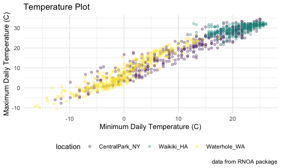

``` r
library(tidyverse)

theme_set(theme_minimal() + theme(legend.position = "bottom"))
options(
  ggplot2.continuous.colour = "viridis",
  ggplot2.continuous.full = "viridis"
)

scale_colour_discrete = scale_color_viridis_d
scale_fill_discrete = scale_fill_viridis_d
```

``` r
central_park =
  weather_df %>% 
  filter (name == "CentralPark_NY")

waikiki =
  weather_df %>% 
  filter (name == "Waikiki_HA")

ggplot(data = waikiki, aes(x = date, y =tmax, color = name)) +
  geom_point() +
  geom_line(data = central_park)
```

    ## Warning: Removed 3 rows containing missing values (geom_point).

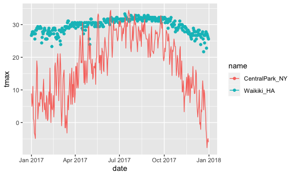

## ‘patchwork’

``` r
weather_df %>% 
  ggplot(aes(x=tmin, fill = name)) +
  geom_density(alpha = 0.5) +
  facet_grid(.~ name)
```

    ## Warning: Removed 15 rows containing non-finite values (stat_density).

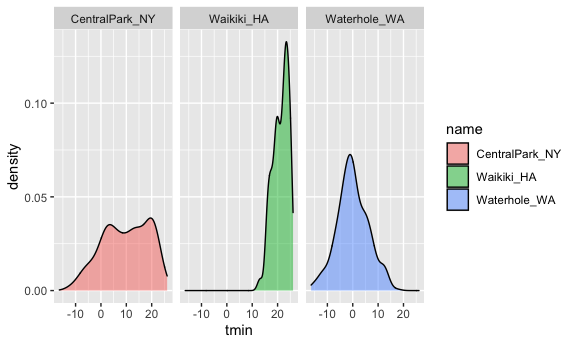

``` r
tmax_tmin_p =
  weather_df %>% 
  ggplot(aes(x=tmin, y = tmax, color = name)) +
  geom_point(alpha = 0.5) +
  theme(legend.position = "none")

prcp_dens_p = 
  weather_df %>% 
  filter(prcp > 0) %>% 
  ggplot(aes(x = prcp, fill = name)) +
  geom_density(alpha = 0.5) +
  theme(legend.position = "none")

tmax_date_p = 
  weather_df %>% 
  ggplot(aes(x = date, y= tmax, color = name)) +
  geom_point() +
  geom_smooth(se = FALSE) +
  theme(legend.position = "none")

(tmax_tmin_p + prcp_dens_p) / tmax_date_p
```

    ## Warning: Removed 15 rows containing missing values (geom_point).

    ## `geom_smooth()` using method = 'loess' and formula 'y ~ x'

    ## Warning: Removed 3 rows containing non-finite values (stat_smooth).

    ## Warning: Removed 3 rows containing missing values (geom_point).

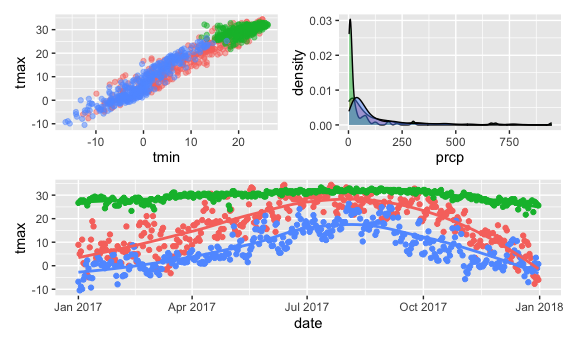
